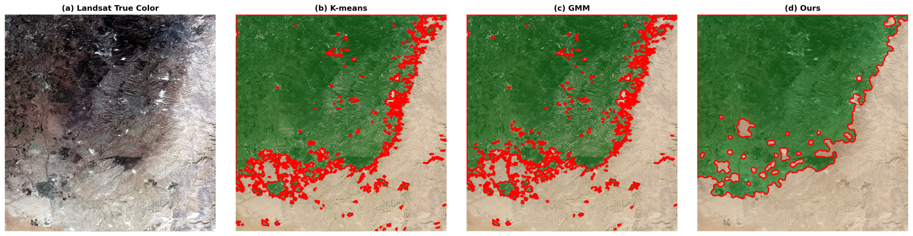
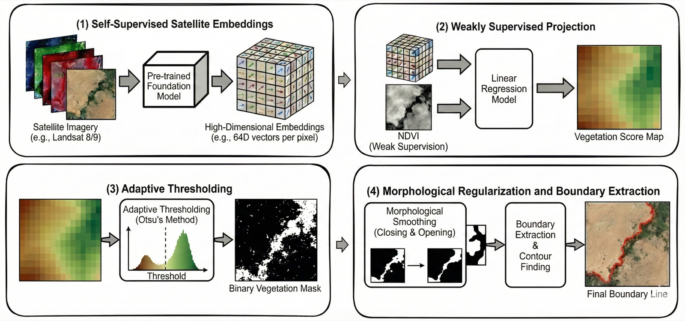

# Desert-Vegetation Boundary Detection via Projection of Self-Supervised Satellite Embeddings

Code for the IGARSS 2026 paper.

> Ido Faran, Nathan S. Netanyahu, Maxim Shoshany. *Desert-Vegetation Boundary Detection via Projection of Self-Supervised Satellite Embeddings.* IEEE International Geoscience and Remote Sensing Symposium (IGARSS), 2026.



## Overview

We project pre-trained, self-supervised satellite embeddings (Google's AlphaEarth) onto a vegetation-aligned axis using NDVI as weak supervision, then extract a coherent desert-vegetation boundary by adaptive thresholding (Otsu) and morphological regularization. The framework requires no manual boundary annotation and produces smoother, more continuous boundaries than direct NDVI clustering on two ecologically distinct transition zones (Beer Sheva, Israel; Tell Atlas margin, Algeria).

Pipeline:

1. **Self-supervised embeddings** — 64-dim AlphaEarth embeddings at 10 m, mean-pooled to 30 m.
2. **Weakly supervised projection** — Ridge regression `NDVI ~ embeddings` yields a 1-D vegetation score.
3. **Adaptive thresholding** — Otsu's method binarises the score map.
4. **Morphological regularisation + boundary extraction** — disk closing/opening, largest connected component, marching squares.



## Installation

```bash
python3 -m venv venv
source venv/bin/activate
pip install -r requirements.txt
earthengine authenticate
```

The Google Earth Engine project ID used in the paper is `ee-faranido`; replace with your own in the downloader scripts if needed.

## Reproducing the paper

The scripts expect data under `data/<region>/`. Steps below produce Beer Sheva; for Algeria, swap the AOI and re-run.

### 1. Acquire data

The downloaders bundle the two paper regions (`beer_sheva`, `algeria`) as built-in AOIs.

```bash
# Landsat 8 Collection 2 L2 surface reflectance (NDVI/SAVI bands)
python downloaders/landsat_savi.py    --year 2022 --region beer_sheva --output data/beer_sheva/
python downloaders/landsat_savi.py    --year 2022 --region algeria    --composite --composite-year 2022 --output data/algeria/

# AlphaEarth (Google Satellite Embedding V1) annual composite
python downloaders/google_embedding.py --year 2022 --region beer_sheva --output data/beer_sheva/
python downloaders/google_embedding.py --year 2022 --region algeria    --output data/algeria/
```

For arbitrary AOIs, supply a KML polygon to `kml_region_downloader.py`.

### 2. Run the pipeline

```bash
python analysis/boundary_detector.py \
    --embeddings data/beer_sheva/google_embedding_2022.tif \
    --landsat   data/beer_sheva/LC08_20221001_SAVI.tif
```

The script writes `data/boundary/boundary_embedding.npz` (smoothed mask, contour, projection weights, fit stats) and an HTML viewer in `outputs/`. The paper figure scripts expect this file under `data/<region>/boundary/`, so move it there:

```bash
mkdir -p data/beer_sheva/boundary && \
    mv data/boundary/boundary_embedding.npz data/beer_sheva/boundary/
```

Repeat for Algeria.

### 3. Reproduce paper figures and metrics

```bash
# Fig. 2: 4-panel comparison (Landsat / K-means / GMM / Ours) — both regions
python analysis/paper_boundary_figure.py

# Fig. 3: detected boundary vs phytogeographic reference (Israel)
python analysis/paper_single_figure.py

# Table 1: R^2, correlation, smoothness gain
python analysis/compute_metrics.py
```

Outputs land in `outputs/`.

## Data sources

| Dataset | GEE catalog ID | Catalog page |
|---|---|---|
| AlphaEarth — Google Satellite Embedding V1 (annual) | `GOOGLE/SATELLITE_EMBEDDING/V1/ANNUAL` | [link](https://developers.google.com/earth-engine/datasets/catalog/GOOGLE_SATELLITE_EMBEDDING_V1_ANNUAL) |
| Landsat 8 Collection 2 Level-2 surface reflectance | `LANDSAT/LC08/C02/T1_L2` | [link](https://developers.google.com/earth-engine/datasets/catalog/LANDSAT_LC08_C02_T1_L2) |

Reference layers used in Fig. 2/3 are bundled in `data/beer_sheva/edge/` (phytogeographic boundary) and `data/beer_sheva/edge250/` (250 mm isohyet). Both were hand-digitized by the authors in Google Earth and are released under this repository's Apache-2.0 license.

## Citation

```bibtex
@inproceedings{faran2026desert,
  title     = {Desert-Vegetation Boundary Detection via Projection of Self-Supervised Satellite Embeddings},
  author    = {Faran, Ido and Netanyahu, Nathan S. and Shoshany, Maxim},
  booktitle = {IEEE International Geoscience and Remote Sensing Symposium (IGARSS)},
  year      = {2026}
}
```

A `CITATION.cff` is provided for tools that consume it.

## License

Apache License 2.0. See `LICENSE`.
